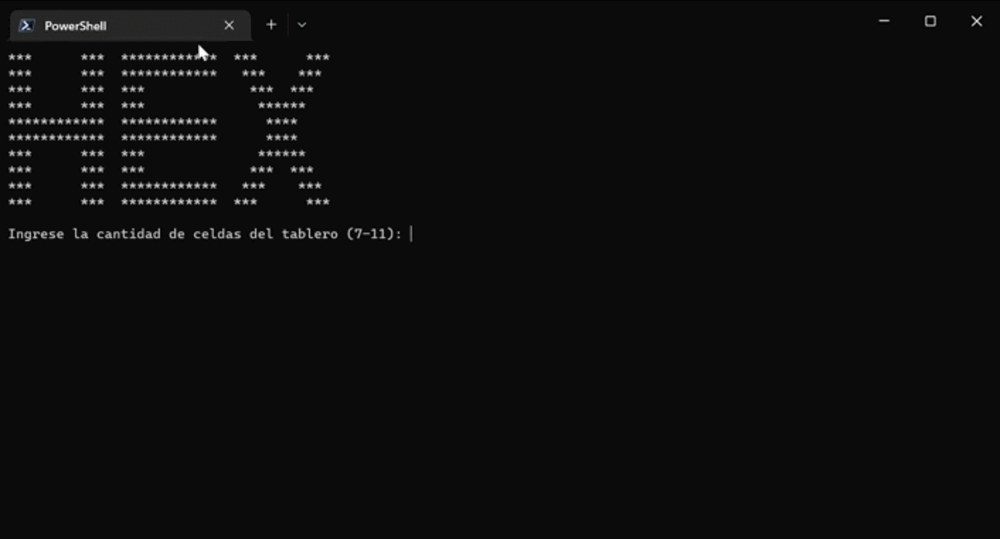

# Hex Game en Consola
```
***      ***  ************  ***      ***
***      ***  ************   ***    ***
***      ***  ***             ***  ***
***      ***  ***              ******
************  ************      ****
************  ************      ****
***      ***  ***              ******
***      ***  ***             ***  ***
***      ***  ************   ***    ***
***      ***  ************  ***      ***
```

## Descripción
Este proyecto es la implementación de un juego de Hex en consola, el cual se puede jugar con dos jugadores o contra la computadora.
Tiene como característica principal que el tablero puede ser de dos tamaños, por lo que el juego puede ser jugado en un tablero de 7x7 o 11x11.
Además, cuenta con tiempos de espera para cada movimiento, con la capacidad de elegir el tiempo de espera que se desea y que el jugador con el turno pueda ver el tiempo que le queda para realizar su movimiento.
Por último, a cada jugador se le puede agregar un nombre para, de ser el caso, identificarlo como ganador al finalizar el juego.

## Requisitos
Para poder ejecutar el juego es necesario tener instalado C++ 14 o superior en el equipo.
Puede ser ejecutado en cualquier sistema operativo que soporte C++ (Windows, Linux, Mac OS, etc.).
Si es posible, tener instalado CMake 3.10 o superior para poder compilar el proyecto de manera directa, usando el archivo CMakeLists.txt incluido en este proyecto.

## Guía de instalación
Para poder ejecutar el juego, se debe descargar el proyecto (como archivo .zip o clonando el repositorio) y descomprimirlo en una carpeta y seguir los siguientes pasos:
1. Abrir una terminal en la carpeta donde se encuentra el proyecto.
2. Crear una carpeta llamada "build" en la carpeta donde se encuentra el proyecto.
3. Abrir una terminal en la carpeta "build".
4. Si se tiene CMake instalado, ejecutar el comando "cmake .." para generar los archivos necesarios para compilar el proyecto, caso contrario, saltar al paso 6.
5. Ejecutar el comando "make" para compilar el proyecto.
6. Si no se tiene CMake instalado, ejecutar el comando "g++ -std=c++14 -o hex ../src/*.cpp" para compilar el proyecto.
7. Ejecutar el comando "./hex" para ejecutar el juego.
8. Seguir las instrucciones que se muestran en pantalla para jugar.

## Instrucciones de uso
1. Al ejecutar el juego, se mostrará un menú con las opciones de juego disponibles.
2. Para jugar, primero debe elegir el tamaño del tablero (7x7 o 11x11) y luego elegir el tiempo de espera para cada movimiento (preferiblemente 10 segundos o más).
3. Luego, debe elegir la cantidad de jugadores (1 para jugar contra la computadora o 2 para jugar contra otro jugador).
4. Si se eligió jugar contra la computadora, se debe introducir el nombre del jugador y comenzará el juego. Si se eligió jugar contra otro jugador, se debe introducir el nombre de ambos jugadores y comenzará el juego. 
5. El juego se juega de la siguiente manera:
   1. Se debe introducir la coordenada de la casilla donde se desea colocar la ficha, en el formato "x y" (sin comillas), donde x es la fila y y es la columna. Por ejemplo, si se desea colocar la ficha en la casilla de la fila 1 y columna 2, se debe introducir "1 2" (sin comillas).
   2. Si el movimiento es válido, se colocará la ficha en la casilla indicada y se le dará el turno al otro jugador.
   3. Si el movimiento no es válido, se considerará como un movimiento perdido y se le dará el turno al otro jugador.
   4. Si el jugador no realiza un movimiento en el tiempo establecido, se considerará como un movimiento perdido y deberá introducir dos números cualesquiera para que el turno pase al otro jugador.
   5. El juego termina cuando un jugador logra conectar sus fichas de un extremo del tablero al otro extremo del tablero, de manera horizontal, vertical o diagonal, de acuerdo con los lados indicados en el tablero.
   6. Al finalizar el juego, se mostrará un mensaje indicando el ganador y terminará el juego.
   7. Si se desea volver a jugar, se debe volver a ejecutar el juego y seguir los pasos indicados en la sección "Instrucciones de uso".

### Animación del juego


## Licencias de uso
Este proyecto está bajo la licencia GNU General Public License v3.0, por lo que se puede usar, modificar y distribuir libremente, siempre y cuando se respete la licencia.

## Diagramas
### Diagrama de clases
```
+------------------------------------------------------------------------+    +------------------------------------------------------------------------+
|                                                                        |    |                                                                        |
|                                  Game                                  |    |                                 Player                                 |
|                                                                        |    |                                                                        |
+------------------------------------------------------------------------+    +------------------------------------------------------------------------+
|                                                                        |    |                                                                        |
| int tableSize;                                                         |    | string name;                                                           |
| vector<vector<char>> table;                                            |    | char playerSymbol;                                                     |
| vector<Player> players;                                                |    | bool isComputer;                                                       |
| int indexOfWinnerPlayer;                                               |    | int timeLeft;                                                          |
| int turnTime;                                                          |    |                                                                        |
|                                                                        |    |                                                                        |
+------------------------------------------------------------------------+    +------------------------------------------------------------------------+
|                                                                        |    |                                                                        |
| string getCenteredText(string text, int width);                        |    |                                                                        |
| string getCenteredTitle(string text, int width);                       |    |                                                                        |
| bool isAWinner(char playerSymbol, bool isVerticalCheck);               |    |                                                                        |
| void printTable();                                                     |    |                                                                        |
|                                                                        |    |                                                                        |
+------------------------------------------------------------------------+    +------------------------------------------------------------------------+
|                                                                        |    |                                                                        |
| Game();                                                                |    | Player(string name, char playerSymbol, bool isComputer, int timeLeft); |
| void setUpGame();                                                      |    | string getName();                                                      |
| void setUpPlayers();                                                   |    | char getPlayerSymbol();                                                |
| void startGame();                                                      |    | bool isIsComputer();                                                   |
| ~Game();                                                               |    | int getTimeLeft();                                                     |
|                                                                        |    | void setTimeLeft(int left);                                            |
|                                                                        |    | void decreaseTimeLeft(int time);                                       |
|                                                                        |    | ~Player();                                                             |
|                                                                        |    |                                                                        |
+------------------------------------------------------------------------+    +------------------------------------------------------------------------+
```

### Diagrama de secuencia
```
+--------------------------+    +--------------------------+    +--------------------------+
|           Game           |    |          Player          |    |          Player          |
+--------------------------+    +--------------------------+    +--------------------------+

+--------------------------+    +--------------------------+    +--------------------------+
| Tamaño del tablero:      |    |                          |    |                          |
| 7x7 ó 11x11              |    |                          |    |                          |
+--------------------------+    +--------------------------+    +--------------------------+

+--------------------------+    +--------------------------+    +--------------------------+
| Tiempo por turno:        |    |                          |    |                          |
| 10 segundos o más        |    |                          |    |                          |
+--------------------------+    +--------------------------+    +--------------------------+

+--------------------------+    +--------------------------+    +--------------------------+
| Cantidad de jugadores:   |    |                          |    |                          |
| 1 o 2                    |    |                          |    |                          |
+--------------------------+    +--------------------------+    +--------------------------+

+--------------------------+    +--------------------------+    +--------------------------+
|                          |    | Nombre del jugador:      |    | Nombre del jugador:      |
|                          |    | Juan                     |    | Javier                   |
+--------------------------+    +--------------------------+    +--------------------------+

+--------------------------+    +--------------------------+    +--------------------------+
|                          |    | Símbolo del jugador:     |    | Símbolo del jugador:     |
|                          |    | R                        |    | A                        |
+--------------------------+    +--------------------------+    +--------------------------+

+--------------------------+    +--------------------------+    +--------------------------+
|                          |    | Es un jugador            |    | Es un jugador            |
|                          |    | computadora:             |    | computadora:             |
|                          |    | Sí                       |    | Sí/No                    |
+--------------------------+    +--------------------------+    +--------------------------+

+--------------------------+    +--------------------------+    +--------------------------+
|                          |    | Tiempo restante:         |    | Tiempo restante:         |
|                          |    | > 10 segundos            |    | > 10 segundos            |
+--------------------------+    +--------------------------+    +--------------------------+

+--------------------------+    +--------------------------+    +--------------------------+
| Mostrar tablero          |    |                          |    |                          |
+--------------------------+    +--------------------------+    +--------------------------+

+--------------------------+    +--------------------------+    +--------------------------+
| Movimiento válido /      |    | Ingresar coordenadas     |    | Ingresar coordenadas     |
| inválido / perdido       |    | de la ficha              |    | de la ficha              |
+--------------------------+    +--------------------------+    +--------------------------+
             ^                               ^                               ^
             |                               |                               |
             |                               |                               |
             |                               |                               |
             .                               .                               .
             .                               .                               .
             .                               .                               .
             |                               |                               |
             |                               |                               |
             |                               |                               |
             v                               v                               v
+--------------------------+    +--------------------------+    +--------------------------+
| Mostrar tablero          |    |                          |    |                          |
+--------------------------+    +--------------------------+    +--------------------------+

+--------------------------+    +--------------------------+    +--------------------------+
| Mostrar ganador          |    |                          |    |                          |
+--------------------------+    +--------------------------+    +--------------------------+
```

## Vídeo de presentación
[](https://www.youtube.com/watch?v=ID_VIDEO)

## Autores
* **Camila Rodriguez Valverde** - *Desarrollador* - [camila]('')
* **Johar Barzola Estrella** - *Desarrollador* - [johar]('')
* **Stuart Arteaga Montes** - *Desarrollador* - [johar]('')
* **Juan Diego Prochazka** - *Desarrollador* - [johar]('')
* **Oscar Ryan Chu Orrego** - *Desarrollador* - [johar]('')


## Bibliografía
* [C++ Programming Language](https://www.cplusplus.com/) - Documentación de C++
* [Hex (board game)]('https://en.wikipedia.org/wiki/Hex_(board_game)') - Wikipedia
